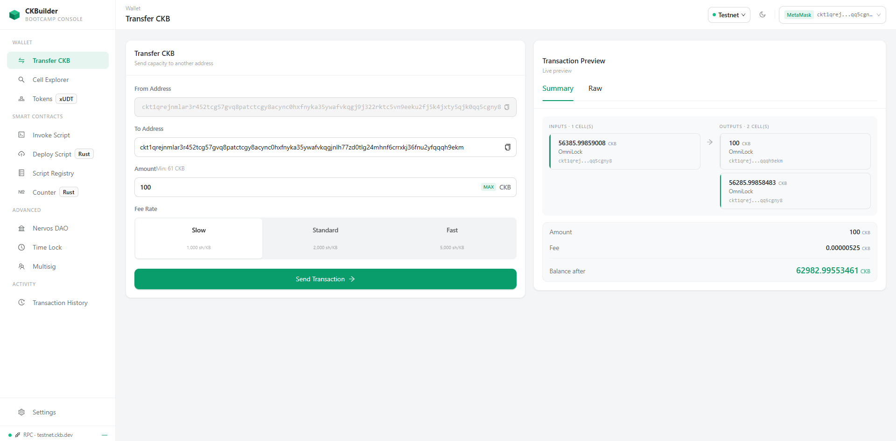
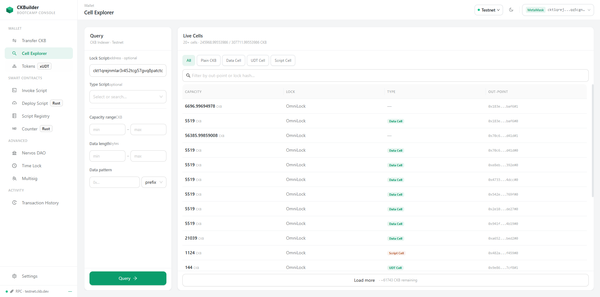
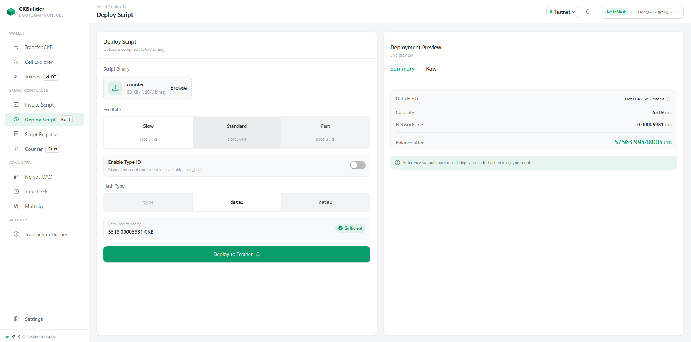
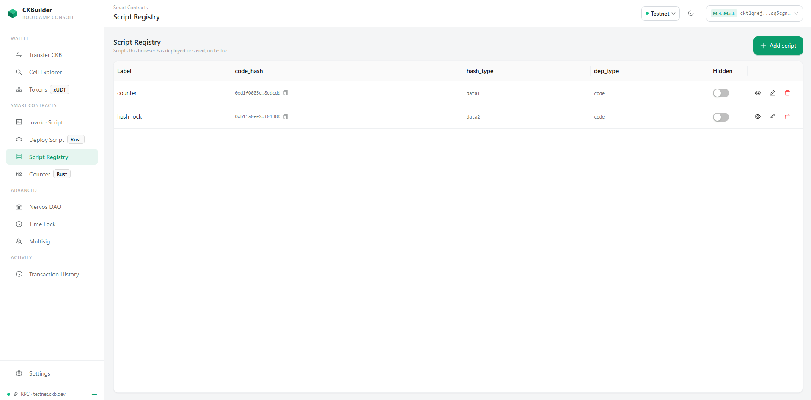
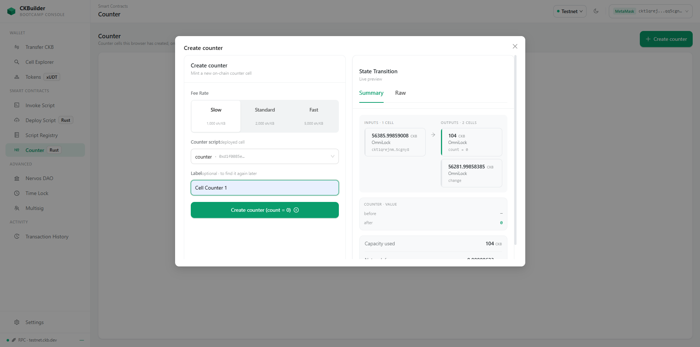

# CKBuilder

A Nervos CKB developer lab. Each page takes one CKB concept and makes it concrete by building a
real transaction against a real chain — you fill in a form, watch the cell inputs and outputs and
the fee resolve in a live preview, sign with your wallet, and follow the transaction from
broadcast to committed. It is built lesson-by-lesson against a 24-part CKB course, so the pages
accumulate roughly one per lesson, and a page exists only once its concept has been worked
through.

It is a learning instrument, not a product. The point is that nothing is mocked: the preview you
see is the transaction that gets signed.

**▶ Live on testnet: https://ck-builder-s1eo.vercel.app** — connect a wallet and build a
transfer. Nothing to install.

## Screenshots

Testnet, wallet connected. Every number in these is real chain data.



*`/transfer` — the form on the left, the cell-model preview on the right. CKB is UTXO-style, so
a transfer is not a balance update: one input cell of 56,385.99 CKB is consumed and two output
cells are created, the 100 CKB going out and the change coming back.*

<details>
<summary><b>Four more — Cell Explorer, Deploy, Registry, Counter</b></summary>



*`/cell-explorer` — the live cells behind that balance, queried straight from the CKB indexer
and filterable by lock, type, capacity range, data length and data prefix.*



*`/deploy` — a compiled RISC-V binary uploaded from the browser, with its `data_hash`, the
capacity the cell will occupy, and the `hash_type` it will be referenced by.*



*`/registry` — scripts this browser has deployed or saved, network-scoped and kept in
`localStorage`. This is what `/invoke` and `/counter` pick from.*



*`/counter` — creating a cell governed by the `counter` Rust type script, previewing the state
transition before signing.*

</details>

## What works today

Five pages build and broadcast real transactions and a sixth is unverified. Five more are routed
and navigable but not yet implemented — they say so on the page, and they name the issue tracking
them.

| Page | Route | Status |
|---|---|---|
| Transfer CKB | `/transfer` | ✅ Works — [docs](ckb-lab/docs/transfer-features.md) |
| Cell Explorer | `/cell-explorer` | ✅ Works — [docs](ckb-lab/docs/cell-explorer-features.md) |
| Deploy Script | `/deploy` | ✅ Works — [docs](ckb-lab/docs/deploy-features.md) |
| Invoke Script | `/invoke` | ⚠️ Unverified — it builds and broadcasts, but no successful end-to-end run is confirmed. The only script driven through it so far (`hash-lock`) was rejected by CKB-VM for the ISA reason below, so the page's own correctness is still untested — [docs](ckb-lab/docs/invoke-features.md) |
| Script Registry | `/registry` | ✅ Works — [docs](ckb-lab/docs/registry-features.md) |
| Counter | `/counter` | ✅ Works — [docs](ckb-lab/docs/counter-features.md) |
| Tokens (xUDT) | `/tokens` | Planned — [M1 · Bootcamp demo](https://github.com/tiennt0212/CKBuilder/milestone/14) · [#47](https://github.com/tiennt0212/CKBuilder/issues/47) |
| Transaction History | `/history` | Planned — [M1 · Bootcamp demo](https://github.com/tiennt0212/CKBuilder/milestone/14) · [#49](https://github.com/tiennt0212/CKBuilder/issues/49) |
| Nervos DAO | `/dao` | Planned — [Advanced](https://github.com/tiennt0212/CKBuilder/milestone/10) · [#67](https://github.com/tiennt0212/CKBuilder/issues/67) |
| Multisig | `/multisig` | Planned — [Custom locks](https://github.com/tiennt0212/CKBuilder/milestone/9) · [#64](https://github.com/tiennt0212/CKBuilder/issues/64) |
| Time Lock | `/time-lock` | Planned — [Custom locks](https://github.com/tiennt0212/CKBuilder/milestone/9) · [#65](https://github.com/tiennt0212/CKBuilder/issues/65) |

Two Rust contracts compile to RISC-V:

| Contract | Crate | Status |
|---|---|---|
| `contracts/lesson-10-counter` | `counter` | A type script enforcing a monotonically increasing counter cell. Covered by a six-case `ckb-testtool` suite, deployed, and driven end-to-end from `/counter` |
| `contracts/lesson-08-hash-lock` | `hash-lock` | A lock script that unlocks on a preimage. Builds, but has no test suite yet and has never run on CKB-VM: `riscv64imac` can emit atomic instructions CKB-VM does not execute, so the binary needs rebuilding with `-C target-feature=-a` first. Tracked by [#63](https://github.com/tiennt0212/CKBuilder/issues/63) and [#66](https://github.com/tiennt0212/CKBuilder/issues/66) |

The full roadmap lives in the [GitHub milestones](https://github.com/tiennt0212/CKBuilder/milestones)
and the [CKBuilder Roadmap board](https://github.com/users/tiennt0212/projects/8).

## Architecture — browser-only, on purpose

There is no backend. Not "a small backend": zero route handlers, zero server actions, and nothing
in the tree imports `fs` or `next/server`. Every chain interaction runs in the browser against a
CKB node's JSON-RPC and is signed by your wallet extension. Every piece of persistence is
`localStorage`, scoped per network.

That is a design decision, and it has consequences worth stating:

- **No auth, no session, no database.** There is no server to hold them, and a lab has nothing
  worth persisting past a redeploy — losing a registry entry costs you a redeploy, not data.
- **A compiled contract reaches the chain by you uploading it** on `/deploy`. The server never
  reads `contracts/build/release/`, because there is no server.
- **Every route prerenders to static content** at build time — visible in the `next build`
  output — so hosting it publicly costs nothing but a CDN.

Stack: Next.js 15 (App Router) · React 18 · Ant Design 5 · Tailwind CSS v4 · Zustand 5 ·
[`@ckb-ccc/core`](https://github.com/ckb-devrel/ccc) for transactions and
`@ckb-ccc/connector-react` for the wallet. Contracts are Rust on `ckb-std`, targeting
`riscv64imac-unknown-none-elf`, tested with `ckb-testtool` on the native host.

## Run it

Two independent toolchains. You need the first to use the app; you need the second only to build
the contracts yourself — deploying a prebuilt binary through `/deploy` does not require Rust.

### The app

```bash
cd ckb-lab
pnpm install
echo "NEXT_PUBLIC_NETWORK=testnet" > .env.local
pnpm dev                                        # http://localhost:3000
```

Then connect a wallet through the CCC connector in the header and fund it from the
[Nervos testnet faucet](https://faucet.nervos.org/).

`NEXT_PUBLIC_NETWORK` accepts `testnet` (default), `devnet`, or `mainnet`, and only picks the
*initial* network — you can switch at runtime from the network picker in the header. `devnet`
additionally needs a local node:

```bash
offckb node                                     # serves JSON-RPC on http://localhost:28114
```

Other commands: `pnpm build` (production build, also runs the TypeScript check), `pnpm lint`,
`pnpm format`, `pnpm storybook` (component workshop on `:6006`).

### The contracts

```bash
rustup target add riscv64imac-unknown-none-elf  # one-time
make -C ckb-lab/contracts build                 # → contracts/build/release/
make -C ckb-lab/contracts test                  # builds first, then runs the ckb-testtool suite
```

`ckb-lab/contracts/` is a **standalone Cargo workspace** — no pnpm command touches it, and it is
not a member of the pnpm workspace. Run the Makefile targets rather than bare cargo: a plain
`cargo test` at the contracts root fails to link, because the test crate must be scoped with
`-p tests`.

To put a built contract on-chain, open `/deploy` and upload the binary from
`ckb-lab/contracts/build/release/`.

## Repo layout

This repository is a workspace of separate projects that happen to share a checkout. It is not a
monorepo — there is no root manifest and the subdirectories share no build.

| Directory | What it is |
|---|---|
| [`ckb-lab/`](ckb-lab/) | **The app.** Next.js frontend + the Rust contracts it deploys |
| [`ckb-rust-example/`](ckb-rust-example/) | A separate Rust spike driving `ckb-sdk` directly — capacity transfer and cell queries from native code |
| [`weekly-report/`](weekly-report/) | Progress reports, one per week |

The directory and pnpm package are named `ckb-lab`; **CKBuilder** is the app's user-facing brand
and the name of this repository.

## Contributing

`ckb-lab/CLAUDE.md` holds the build conventions, and `ckb-lab/.context/` holds the deeper
context — start at [`.context/INDEX.md`](ckb-lab/.context/INDEX.md). Two files are worth reading
before touching CKB code: `.context/processes/gotchas.md` (CKB failures surface far from their
cause) and `.context/glossary/ckb-terms.md` (CKB is UTXO-style; an account model is the wrong
mental model here).

Every task is `lab-spike` or `polished`, set by its GitHub issue label — see
`.context/processes/definition-of-done.md` for what each tier requires.
